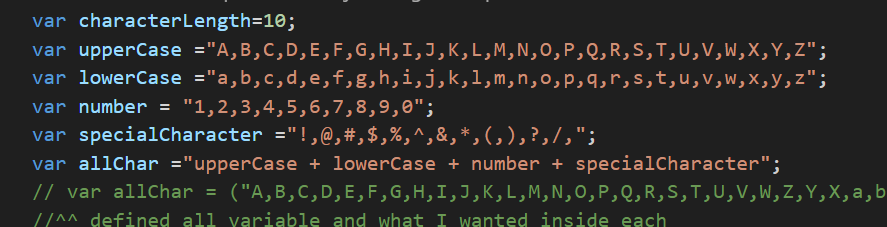
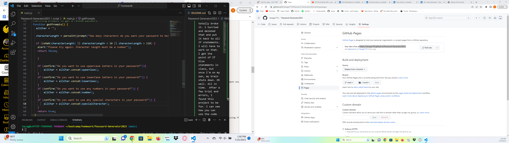

# Password-Generator2023

## Description

Password Generator was surprise... tricky. I reworked the code a few times. Started from scratch again. I go it to work and then tried to do the If Else statements and totally broke it. I hurried and deleted that and put it back to all If statements. I will have to work on that. I get the point of If Else statements in class, but once I'm on my own, my brain shuts down. Oh well. All in time.  After a few trial and errors, I found this project to be fun. I can see how you can use the code(with a little tweaking of course) and use this in several other areas. To some people I can see them thinking their password is super clever and no body will ever figure it out. Fast forward a few weeks and their accounts get hacked. This little program can and I'm sure has saved a few people from complete chaos should thier account get hacked.  As always I have learned that this takes time to understand. I watched several Youtube videos, googeled countless things, and rewatched Stanley's previous Cohorts to figure this out.  I have a long way to go to consider myself a web developer but I know for a fact it will be a fun journey!

## Table Of Contents
N/A

##Installation
N/A

## Usage
Here is the URL of my page
 https://saragar710.github.io/Password-Generator2023/

Here is a  few screen shots of my code.

## Credits
The internet

## License
Please refer to the LICSENSE in the repo.

